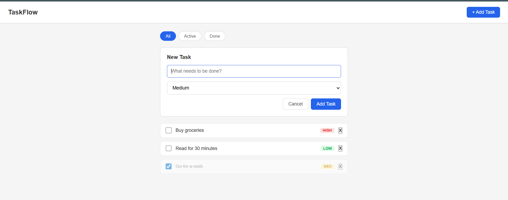

# ✅ TaskFlow — React Todo Manager

A clean, fully functional task management app built from scratch with React. This is the first project in my 3-part React learning series, covering all core fundamentals from JSX to controlled forms.

**[Live Demo →](https://react-taskflow.vercel.app)** &nbsp;|&nbsp; **[My React Learning Journey →](https://github.com/Nikhilsatish)**

---

## 📸 Preview



---

## ✨ Features

- Add, delete, and toggle tasks as complete
- Filter tasks by **All / Active / Done**
- Priority badges — High / Medium / Low
- Form validation with inline error messages
- Empty state when no tasks match the filter
- Clean component-based architecture

---

## 🧠 React Concepts Practiced

This project was built intentionally to practice these specific React topics:

| Topic                               | What I implemented                                                                                            |
| ----------------------------------- | ------------------------------------------------------------------------------------------------------------- |
| **R1 — What is React**              | Scaffolded with Vite, understood why React over vanilla JS                                                    |
| **R2 — JSX & rendering**            | Wrote JSX, understood it compiles to `React.createElement`                                                    |
| **R3 — Components**                 | Split UI into `Header`, `TaskList`, `TaskCard`, `TaskForm`, `FilterTabs` — both function and class components |
| **R4 — Props & drilling**           | Passed `task` data from `App → TaskList → TaskCard`, felt the drilling pain                                   |
| **R5 — State & setState**           | Held `tasks[]` in `useState`, never mutated directly                                                          |
| **R6 — Event handling**             | `onClick` for delete/toggle, `onChange` for inputs, `onSubmit` for form                                       |
| **R7 — Conditional rendering**      | Empty state message, priority badge colors, done/undone styles                                                |
| **R8 — Lists & keys**               | `.map()` over tasks, learned why `key={task.id}` beats `key={index}`                                          |
| **R9 — Controlled vs uncontrolled** | Built form as controlled first, rewrote one field with `useRef` to compare                                    |
| **R10 — Forms handling**            | Multi-field form with title, priority, validation, and reset on submit                                        |

---

## 🗂️ Project Structure

```
src/
├── components/
│   ├── Header.jsx          # App title + task count badge
│   ├── TaskList.jsx         # Maps over tasks, shows empty state
│   ├── TaskCard.jsx         # Single task row with toggle + delete
│   ├── TaskForm.jsx         # Controlled form with validation
│   └── FilterTabs.jsx       # All / Active / Done tabs
├── App.jsx                  # All state lives here
├── App.css
└── main.jsx
```

---

## 🚀 Run Locally

```bash
git clone https://github.com/Nikhilsatish/react-taskflow.git
cd react-taskflow
npm install
npm run dev
```

Open [http://localhost:5173](http://localhost:5173)

---

## 🔑 Key Learnings

**1. Why controlled inputs are preferred**
When I tried to do validation using an uncontrolled input (`useRef`), I had no way to show real-time error messages or pre-fill values on edit. Controlled inputs give you full power over the input's value at all times.

**2. Derived state vs stored state**
I initially stored `filteredTasks` in `useState` separately. This caused sync bugs when the `tasks` array changed. The fix: derive it inline — `tasks.filter(...)` — never duplicate state.

**3. The key={index} bug**
When I used array index as key and deleted the first task, React reused the wrong DOM node and the checkboxes shifted. Switching to `key={task.id}` fixed it instantly. DevTools made this visible.

---

## 🛠️ Built With

- [React 18](https://react.dev)
- [Vite](https://vitejs.dev)
- Vanilla CSS

---

## 📌 Part of My React Series

| Project                                                                 | Topics                            | Status         |
| ----------------------------------------------------------------------- | --------------------------------- | -------------- |
| **TaskFlow** (this one)                                                 | R1–R10 Fundamentals               | ✅ Complete    |
| [ExpenseTracker](https://github.com/Nikhilsatish/expense-tracker-react) | R11–R20 Hooks + Context + Router  | 🔨 In progress |
| [DevBoard](https://github.com/Nikhilsatish/devboard-github-explorer)    | R21–R30 Redux + Advanced Patterns | ⏳ Upcoming    |

---

## 👨‍💻 Author

**Nikhil** — Senior Software Engineer  
[GitHub](https://github.com/Nikhilsatish) · [LinkedIn](https://linkedin.com/in/nikhil-sathish)
